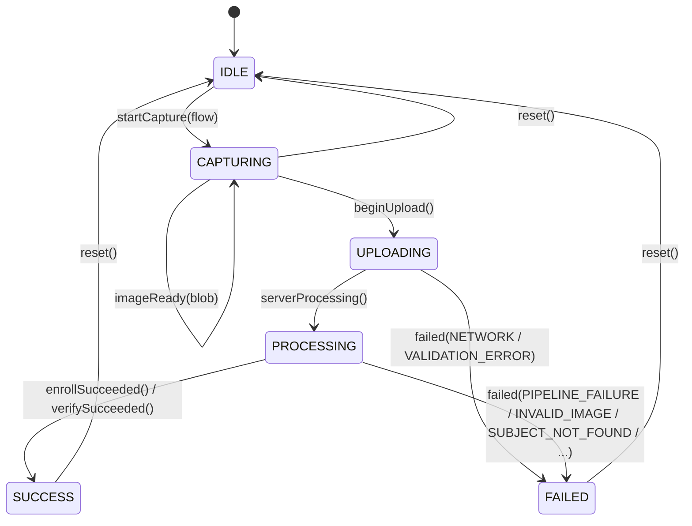
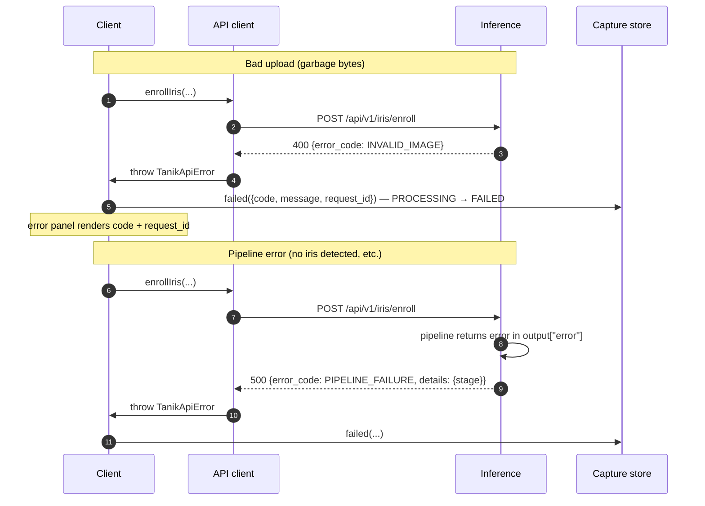
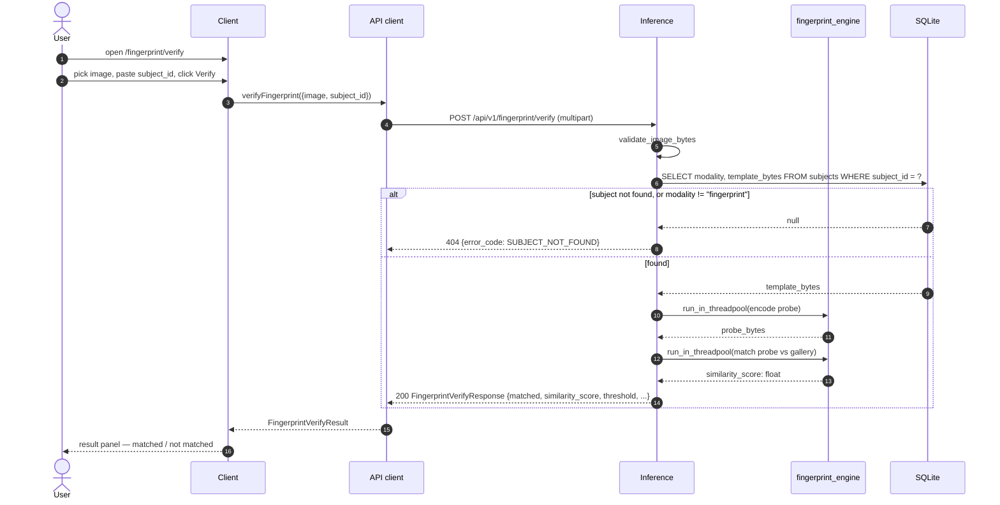
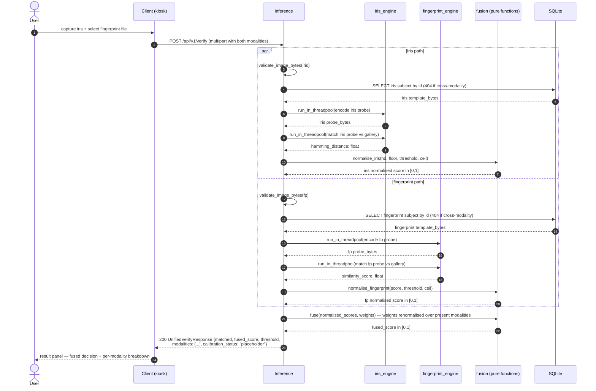

# Sequence flow — TANIK

Visual companion to `docs/api-contract.md`. Shows what actually happens, in order, when a user enrolls or verifies through the kiosk.

Coverage as of Phase 3 #41:
- **Iris** enroll + verify (Phase 1)
- **Fingerprint** enroll + verify (Phase 2)
- **Unified, fused** verify across both modalities (Phase 3 #41)
- Failure paths for all of the above

The capture state machine is the same for every modality and every flow — only the API call and the result panel differ.

---

## Capture state machine

The Zustand store in `apps/client/lib/store.ts` enforces these transitions strictly. Illegal transitions throw in dev (kiosk uptime trumps strictness in prod, where they log instead).



`UPLOADING` and `PROCESSING` are distinct states by design. In v1 they're effectively back-to-back (we have no fetch-progress signal, so the transition is immediate), but the distinction exists so that liveness streaming in Phase 4 can split the bytes-going-up phase from the server-doing-work phase without re-shaping the machine.

---

## Enroll flow

```mermaid
sequenceDiagram
    autonumber
    actor U as User
    participant C as Client (Next.js, browser)
    participant W as WebcamCapture
    participant S as Capture store (Zustand)
    participant A as API client (lib/api.ts)
    participant B as Inference (FastAPI)
    participant M as IRISPipeline (open-iris, threadpool)
    participant D as SQLite

    U->>C: open /enroll
    C->>S: startCapture("enroll") — IDLE → CAPTURING
    C->>W: mount, getUserMedia({video})
    W-->>C: live preview
    U->>W: click Capture (or pick a file)
    W->>C: PNG blob from canvas.toBlob
    C->>S: imageReady(blob) — held in CAPTURING
    U->>C: fill display_name, eye_side; click Enroll
    C->>S: beginUpload() — CAPTURING → UPLOADING
    C->>A: enrollIris({image, display_name, eye_side})
    A->>B: POST /api/v1/iris/enroll (multipart)
    C->>S: serverProcessing() — UPLOADING → PROCESSING
    B->>B: validate_image_bytes (magic-byte check)
    B->>M: run_in_threadpool(encode)
    M-->>B: template_bytes (engine-serialized)
    B->>D: INSERT subject (subject_id, modality, template_bytes, metadata_json, ...)
    B-->>A: 201 EnrollResponse {subject_id, template_version, ...}
    A-->>C: EnrollResult
    C->>S: enrollSucceeded(result) — PROCESSING → SUCCESS
    C-->>U: success panel + deep-link to /verify?subject_id=...
    Note over W: useEffect cleanup on navigation:<br/>stream.getTracks().forEach(t => t.stop())
```

### Failure paths



---

## Verify flow

Verify is **1:1**: the client supplies `subject_id` (typically deep-linked from `/enroll` or pasted by the operator). There is no 1:N identification endpoint in v1.

```mermaid
sequenceDiagram
    autonumber
    actor U as User
    participant C as Client (Next.js, browser)
    participant W as WebcamCapture
    participant S as Capture store
    participant A as API client
    participant B as Inference (FastAPI)
    participant M as IRISPipeline + HammingDistanceMatcher
    participant D as SQLite

    U->>C: open /verify?subject_id=…
    C->>S: startCapture("verify") — IDLE → CAPTURING
    C->>W: mount, getUserMedia({video})
    W-->>C: live preview
    U->>W: capture (or upload file)
    W->>C: PNG blob
    C->>S: imageReady(blob)
    U->>C: confirm subject_id; click Verify
    C->>S: beginUpload() — CAPTURING → UPLOADING
    C->>A: verifyIris({image, subject_id})
    A->>B: POST /api/v1/iris/verify (multipart)
    C->>S: serverProcessing() — UPLOADING → PROCESSING
    B->>B: validate_image_bytes
    B->>D: SELECT modality, template_bytes FROM subjects WHERE subject_id = ?
    alt subject not found, or modality != "iris"
        D-->>B: null
        B-->>A: 404 {error_code: SUBJECT_NOT_FOUND}
    else found
        D-->>B: template_bytes
        B->>M: run_in_threadpool(encode probe)
        M-->>B: probe template_bytes
        B->>M: run_in_threadpool(match probe vs gallery)
        M-->>B: hamming_distance: float
        B-->>A: 200 VerifyResponse {matched, hamming_distance, threshold, ...}
    end
    A-->>C: VerifyResult
    C->>S: verifySucceeded(result) — PROCESSING → SUCCESS
    C-->>U: result panel (matched / not matched, with HD + threshold)
```

### Note on the threshold

`matched` is exactly `hamming_distance < threshold`. The threshold is **server-configured** (env var `TANIK_IRIS_MATCH_THRESHOLD`, default `0.37`) and returned in every response. The client must not invent its own threshold — it displays what the server returned. The Phase 3 threshold-slider UI (task `#42`) will let an operator move the threshold and re-decide live against the test set; that lands once the test-set dataset (`#11`) is in.

---

## Fingerprint enroll flow (Phase 2)

Fingerprint enrolment is **upload-only** — webcam capture is not feasible for fingerprints (regular cameras lack the resolution and consistency a fingerprint matcher needs). The state machine compresses to a file-pick instead of a `getUserMedia` stream.

```mermaid
sequenceDiagram
    autonumber
    actor U as User
    participant C as Client (Next.js, browser)
    participant S as Capture store (Zustand)
    participant A as API client (lib/api.ts)
    participant B as Inference (FastAPI)
    participant F as fingerprint_engine (SourceAFIS via JPype, threadpool)
    participant J as JVM (one per process)
    participant D as SQLite

    U->>C: open /fingerprint/enroll
    C->>S: startCapture("enroll") — IDLE → CAPTURING
    U->>C: pick a fingerprint image file
    C->>S: imageReady(blob) — held in CAPTURING
    U->>C: fill display_name, finger_position; click Enroll
    C->>S: beginUpload() — CAPTURING → UPLOADING
    C->>A: enrollFingerprint({image, display_name, finger_position})
    A->>B: POST /api/v1/fingerprint/enroll (multipart)
    C->>S: serverProcessing() — UPLOADING → PROCESSING
    B->>B: validate_image_bytes (magic-byte check)
    B->>F: run_in_threadpool(encode)
    F->>J: ensure_jvm() — first call only<br/>startJVM(classpath=[sourceafis-3.18.1.jar])
    J-->>F: JVM ready
    F->>J: FingerprintImage(bytes) → FingerprintTemplate
    J-->>F: native CBOR template_bytes
    F-->>B: template_bytes
    B->>D: INSERT subject (modality="fingerprint", template_bytes, metadata={"finger_position": ...})
    B-->>A: 201 FingerprintEnrollResponse {subject_id, template_version: "sourceafis/3.18.1", ...}
    A-->>C: FingerprintEnrollResult
    C->>S: enrollSucceeded(result) — PROCESSING → SUCCESS
    C-->>U: success panel + subject_id
```

The JVM is started lazily on first call and reused for the lifetime of the process — `_ensure_jvm()` is a no-op after that. JPype enforces single-JVM-per-process, which lines up with FastAPI's single-worker deployment model.

## Fingerprint verify flow (Phase 2)



`matched` is exactly `similarity_score >= threshold`. The threshold is **server-configured** (`TANIK_FINGERPRINT_MATCH_THRESHOLD`, default `40.0` — SourceAFIS's documented FMR=0.01% threshold) and returned in every response.

A wrong-modality `subject_id` (an iris subject_id passed to the fingerprint endpoint) returns `404 SUBJECT_NOT_FOUND` rather than leaking that the subject exists in another modality — cross-modality lookups are deliberately invisible to a probing client.

## Unified, fused verify flow (Phase 3 #41)

The unified endpoint accepts iris and/or fingerprint in a single multipart upload. Each engine-native score is normalised to `[0, 1]`; weights are renormalised over the modalities the request actually supplied; the fused decision is a single threshold comparison. See `docs/fusion.md` for the math.



### What the response signals

- `matched` — `fused_score >= threshold` (server-configured, `TANIK_FUSION_DECISION_THRESHOLD`, default `0.5`).
- `modalities[]` — one entry per modality supplied. Each carries the engine-native score, the normalised score, and the renormalised weight this modality contributed to `fused_score`.
- `calibration_status: "placeholder"` — in-band honesty signal until Phase 3 #43 ships measured weights. A downstream system that needs measured FAR/FRR must refuse a placeholder response.

### Single-modality unified call

If only iris (or only fingerprint) is supplied, the absent modality's path is skipped and weights are renormalised over only the present modality — so its weight becomes `1.0` and `fused_score` cleanly equals its normalised score. There is no "halving by the absent modality" artefact.

### Half-supplied requests are rejected at the boundary

A request that supplies `iris_image` without `iris_subject_id` (or vice versa, for either modality) is almost always a client bug, so it returns 400 `VALIDATION_ERROR` before any engine work runs. Same for an entirely empty request body.

---

## What's NOT in current scope

- **No 1:N identification.** No "find which subject this iris matches" endpoint exists. `verify` is always against a known `subject_id`.
- **No liveness gate.** A printed photo of an enrolled iris will currently match. Phase 4 adds the PAD gate, returning 503 `PAD_FAILURE` before the biometric pipeline runs. See `docs/pad.md`.
- **Calibration is placeholder, not tuned.** Phase 3 #41 shipped the unified endpoint; the weights and normalisation knobs are explicit placeholders until Phase 3 #43 publishes measured numbers. The `calibration_status` field surfaces this in-band.
- **No template aggregation.** Each enroll creates a new subject. Re-enrolling the same person under the same `display_name` produces a separate `subject_id`.
- **No cross-modality subject linking.** A human enrolling both iris and fingerprint produces two distinct `subject_id`s; the unified endpoint takes both. Linking them under a `person_id` is a Phase 4 admin-surface decision (BACKLOG entry).
- **No authentication.** Single-deployment, no users. Phase 4 adds the operator authn for the admin surface.

These are deliberate scope choices, not omissions. See `ROADMAP.md` for the per-phase definitions of done.
