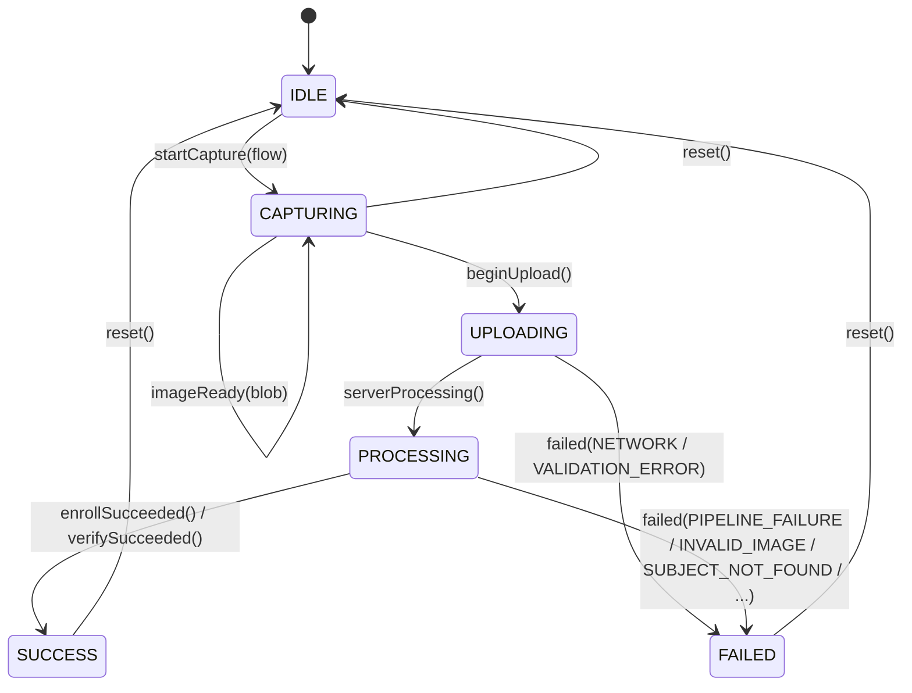
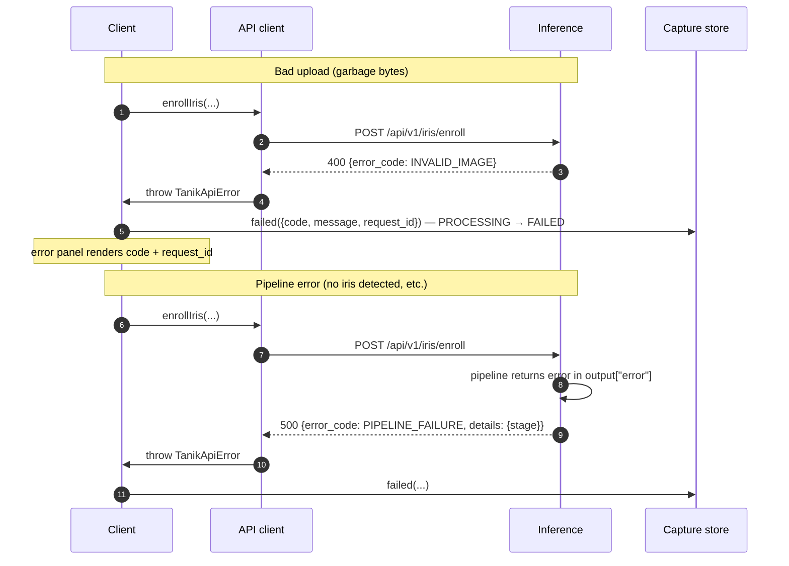

# Sequence flow — TANIK v1 (iris-only)

This document is the visual companion to `docs/api-contract.md`. It shows what actually happens, in order, when a user enrolls or verifies through the kiosk. Iris-only for v1; fingerprint and fusion arrive in Phases 2 and 3.

The capture state machine is the same for both flows — only the API call and the result panel differ.

---

## Capture state machine

The Zustand store in `apps/client/lib/store.ts` enforces these transitions strictly. Illegal transitions throw in dev (kiosk uptime trumps strictness in prod, where they log instead).



`UPLOADING` and `PROCESSING` are distinct states by design. In v1 they're effectively back-to-back (we have no fetch-progress signal, so the transition is immediate), but the distinction exists so that liveness streaming in Phase 4 can split the bytes-going-up phase from the server-doing-work phase without re-shaping the machine.

---

## Enroll flow

```mermaid
sequenceDiagram
    autonumber
    actor U as User
    participant C as Client (Next.js, browser)
    participant W as WebcamCapture
    participant S as Capture store (Zustand)
    participant A as API client (lib/api.ts)
    participant B as Inference (FastAPI)
    participant M as IRISPipeline (open-iris, threadpool)
    participant D as SQLite

    U->>C: open /enroll
    C->>S: startCapture("enroll") — IDLE → CAPTURING
    C->>W: mount, getUserMedia({video})
    W-->>C: live preview
    U->>W: click Capture (or pick a file)
    W->>C: PNG blob from canvas.toBlob
    C->>S: imageReady(blob) — held in CAPTURING
    U->>C: fill display_name, eye_side; click Enroll
    C->>S: beginUpload() — CAPTURING → UPLOADING
    C->>A: enrollIris({image, display_name, eye_side})
    A->>B: POST /api/v1/iris/enroll (multipart)
    C->>S: serverProcessing() — UPLOADING → PROCESSING
    B->>B: validate_image_bytes (magic-byte check)
    B->>M: run_in_threadpool(encode)
    M-->>B: template_bytes (engine-serialized)
    B->>D: INSERT subject (subject_id, modality, template_bytes, metadata_json, ...)
    B-->>A: 201 EnrollResponse {subject_id, template_version, ...}
    A-->>C: EnrollResult
    C->>S: enrollSucceeded(result) — PROCESSING → SUCCESS
    C-->>U: success panel + deep-link to /verify?subject_id=...
    Note over W: useEffect cleanup on navigation:<br/>stream.getTracks().forEach(t => t.stop())
```

### Failure paths



---

## Verify flow

Verify is **1:1**: the client supplies `subject_id` (typically deep-linked from `/enroll` or pasted by the operator). There is no 1:N identification endpoint in v1.

```mermaid
sequenceDiagram
    autonumber
    actor U as User
    participant C as Client (Next.js, browser)
    participant W as WebcamCapture
    participant S as Capture store
    participant A as API client
    participant B as Inference (FastAPI)
    participant M as IRISPipeline + HammingDistanceMatcher
    participant D as SQLite

    U->>C: open /verify?subject_id=…
    C->>S: startCapture("verify") — IDLE → CAPTURING
    C->>W: mount, getUserMedia({video})
    W-->>C: live preview
    U->>W: capture (or upload file)
    W->>C: PNG blob
    C->>S: imageReady(blob)
    U->>C: confirm subject_id; click Verify
    C->>S: beginUpload() — CAPTURING → UPLOADING
    C->>A: verifyIris({image, subject_id})
    A->>B: POST /api/v1/iris/verify (multipart)
    C->>S: serverProcessing() — UPLOADING → PROCESSING
    B->>B: validate_image_bytes
    B->>D: SELECT modality, template_bytes FROM subjects WHERE subject_id = ?
    alt subject not found, or modality != "iris"
        D-->>B: null
        B-->>A: 404 {error_code: SUBJECT_NOT_FOUND}
    else found
        D-->>B: template_bytes
        B->>M: run_in_threadpool(encode probe)
        M-->>B: probe template_bytes
        B->>M: run_in_threadpool(match probe vs gallery)
        M-->>B: hamming_distance: float
        B-->>A: 200 VerifyResponse {matched, hamming_distance, threshold, ...}
    end
    A-->>C: VerifyResult
    C->>S: verifySucceeded(result) — PROCESSING → SUCCESS
    C-->>U: result panel (matched / not matched, with HD + threshold)
```

### Note on the threshold

`matched` is exactly `hamming_distance < threshold`. The threshold is **server-configured** (env var `TANIK_IRIS_MATCH_THRESHOLD`, default `0.37`) and returned in every response. The client must not invent its own threshold — it displays what the server returned. The Phase 3 threshold-slider UI will let an operator move the threshold and re-decide live against the test set; that is a Phase 3 affordance, not a v1 client capability.

---

## What's NOT in v1

- **No 1:N identification.** No "find which subject this iris matches" endpoint exists. `verify` is always against a known `subject_id`.
- **No liveness gate.** A printed photo of an enrolled iris will currently match. Liveness arrives in Phase 4 with `error_code: PAD_FAILURE`.
- **No fingerprint, no fusion.** The unified `/api/v1/verify` endpoint and fused score arrive in Phase 3.
- **No template aggregation.** Each enroll creates a new subject. Re-enrolling the same person under the same `display_name` produces a separate `subject_id`.
- **No authentication.** Single-deployment, no users.

These are deliberate scope choices, not omissions. See `ROADMAP.md` for the per-phase definitions of done.
